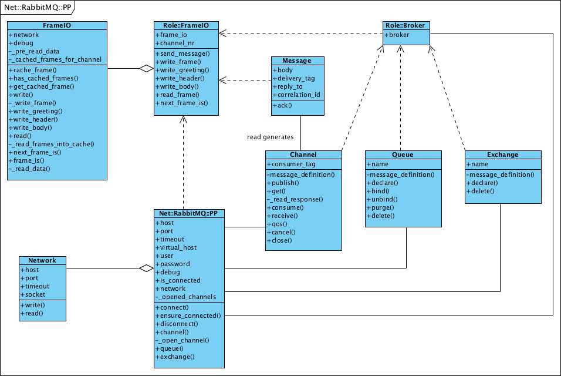

Net::RabbitMQ::PP
=================

A pure Perl implementation for a RabbitMQ client. This distribution aims
to offer as many classes as needed to make all things offered by RabbitMQ
feel natural.

